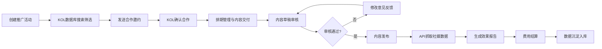

## 1. 产品概述

KOL Star 是一款面向品牌方市场团队的网红/KOL合作管理平台，实现从KOL筛选、合作邀约、内容审核到效果追踪的全流程数字化管理。通过数据沉淀和智能分析，帮助品牌高效管理KOL合作，提升营销ROI。

- **目标用户**：品牌方市场团队、营销管理人员、KOL运营专员
- **核心价值**：全流程闭环管理、数据驱动决策、效率提升300%

## 2. 核心 Features

### 2.1 用户角色

| 角色 | 注册方式 | 核心权限 |
|------|----------|----------|
| 市场管理员 | 企业邮箱注册 | 全部功能权限、数据导出、团队管理 |
| 品牌专员 | 管理员邀请 | 活动创建、KOL搜索、邀约发送、内容审核 |
| 财务人员 | 管理员邀请 | 费用审批、结算管理、报表导出 |

### 2.2 功能模块

1. **数据概览看板**：核心指标展示、活动进度追踪、KOL表现榜单
2. **活动管理**：推广活动创建、活动列表、活动详情、KPI设置
3. **KOL搜索库**：多维度筛选（粉丝量/垂类/平台）、KOL详情、历史合作数据
4. **邀约管理**：合作邀约发送、邀约状态追踪、合作确认
5. **排期管理**：内容交付节点、发布日期管理、内容要求配置
6. **内容审核**：草稿提交、审核意见、版本对比、通过/驳回
7. **数据报告**：社媒数据抓取、KPI对比、自动生成效果报告
8. **费用结算**：费用记录、里程碑付款、结算状态追踪
9. **KOL数据沉淀**：历史表现数据、评分体系、智能推荐

### 2.3 页面详情

| 页面名称 | 模块名称 | 功能描述 |
|----------|----------|----------|
| 数据概览 | 指标卡片 | 展示在途活动数、待审核内容、本月预算、ROI数据 |
| 数据概览 | 趋势图表 | 曝光量/互动量/转化点击的趋势折线图 |
| 数据概览 | KOL榜单 | TOP10表现KOL排名卡片 |
| 活动管理 | 活动列表 | 活动卡片展示，支持搜索筛选和状态切换 |
| 活动管理 | 创建活动 | 活动基本信息、KPI设置、预算配置表单 |
| KOL搜索 | 筛选面板 | 粉丝量区间、垂类标签、平台选择、价格区间筛选 |
| KOL搜索 | KOL卡片 | 头像、名称、粉丝数、平台、垂类、报价、评分展示 |
| KOL搜索 | KOL详情 | 个人信息、历史合作记录、数据表现、内容样例 |
| 邀约管理 | 邀约列表 | 邀约状态（待确认/已确认/已拒绝）标签和进度条 |
| 邀约管理 | 发送邀约 | 合作内容、费用、时间要求的邀约表单 |
| 排期管理 | 时间线 | 内容交付节点时间轴，可视化展示各阶段进度 |
| 内容审核 | 审核面板 | 内容预览、审核意见输入、版本历史对比 |
| 数据报告 | 报告详情 | 实际数据vs预期KPI对比图表，归因分析 |
| 费用结算 | 付款计划 | 里程碑付款节点，定金/尾款状态追踪 |
| KOL沉淀 | 历史库 | 已合作KOL列表，评分体系，表现数据对比 |

## 3. 核心流程

## 4. 用户界面设计

### 4.1 设计风格

**品牌调性**：专业、现代、数据感、商务

- **主色调**：深邃藏蓝 `#1E3A5F` - 代表专业与信任
- **辅助色**：活力橙 `#FF6B35` - 代表创意与活力，用于CTA和重要提醒
- **强调色**：翡翠绿 `#10B981` - 成功状态、数据达标
- **警示色**：珊瑚红 `#EF4444` - 风险提示、驳回状态
- **中性色**：从 `#F8FAFC` 到 `#1E293B` 的多层次灰度体系

**字体选择**：
- 标题字体：`"Space Grotesk"` - 现代几何无衬线，科技感十足
- 正文字体：`"Inter"` - 清晰易读，数字展示友好
- 数据字体：`"JetBrains Mono"` - 等宽字体，数据表格对齐

**视觉元素**：
- 卡片式布局，圆角 `12px`，微妙投影
- 数据可视化采用渐变填充和微动效
- 进度指示器使用线性进度条配合脉冲动画
- 图标采用线性风格，统一 `1.5px` 描边

### 4.2 页面设计概览

| 页面名称 | 模块名称 | UI Elements |
|----------|----------|-------------|
| 数据概览 | 指标卡片 | 大字号数据展示、环比箭头、彩色渐变背景、悬停抬升效果 |
| 数据概览 | 趋势图表 | 面积图渐变填充、数据点hover提示、多维度切换 |
| KOL搜索 | 筛选面板 | 滑出式侧边栏、标签多选、滑块区间选择、实时刷新 |
| KOL搜索 | KOL卡片 | 头像裁切为圆形、粉丝数K/M格式化、评分星星展示 |
| 排期管理 | 时间线 | 垂直时间轴、节点状态圆点、连接线动画 |
| 内容审核 | 对比视图 | 左右分屏、版本标签、差异高亮标注 |
| 数据报告 | KPI对比 | 仪表盘样式、进度环、目标线标记、达标率色块 |

### 4.3 响应式

- **桌面优先**：基于1440px宽度设计，最大内容宽度1280px
- **平板适配**：1024px断点，侧边栏收缩为图标导航
- **移动适配**：768px断点，底部Tab导航，卡片单列布局
- **触控优化**：最小触控目标48x48px，避免悬浮依赖操作

### 4.4 动效设计

- 页面加载：元素错峰入场动画（staggered reveal），延迟50ms递增
- 卡片悬停：y轴抬升4px，阴影加深，过渡时长200ms ease-out
- 数据更新：数字滚动动画，从旧值平滑过渡到新值
- 状态变更：状态标签颜色渐变过渡，配合轻微缩放脉冲
- 模态框：背景模糊 + 缩放入场，300ms cubic-bezier(0.4, 0, 0.2, 1)
