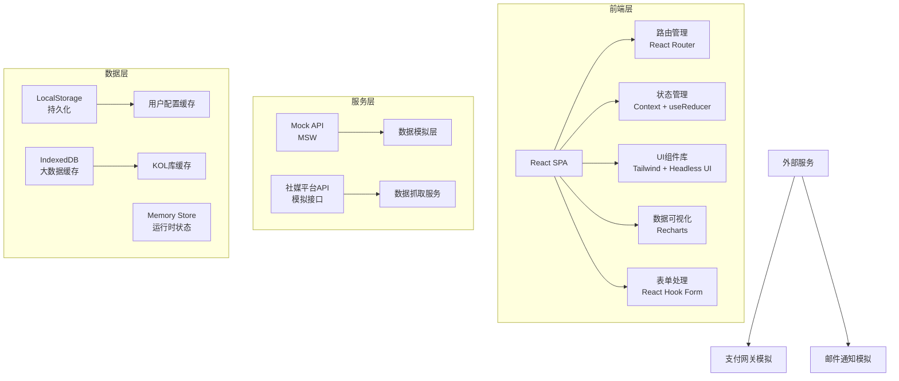
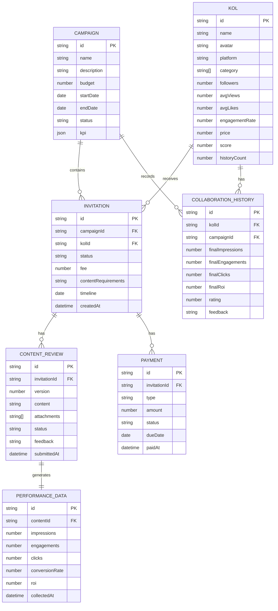
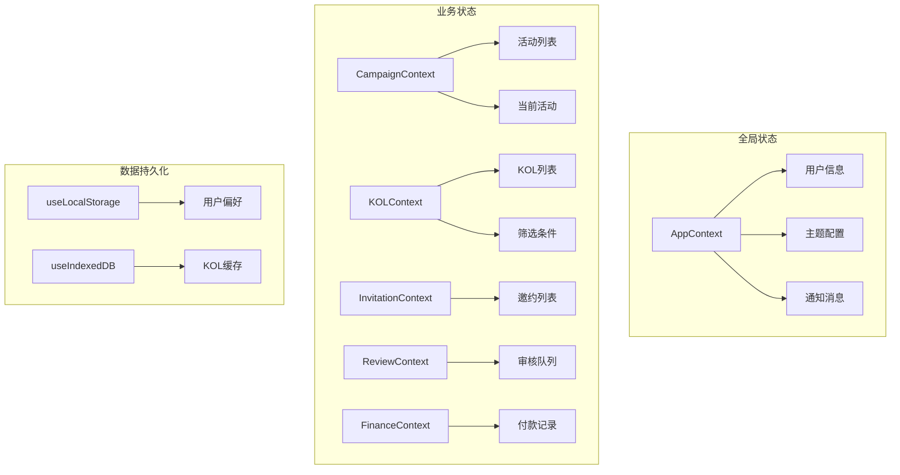

## 1. 架构设计



## 2. 技术描述

### 2.1 前端技术栈

- **核心框架**：React 18.2.0
- **构建工具**：Vite 5.0.0
- **编程语言**：TypeScript 5.3.0
- **CSS 框架**：Tailwind CSS 3.4.0
- **路由管理**：React Router DOM 6.20.0
- **状态管理**：React Context + useReducer（轻量级方案）
- **数据可视化**：Recharts 2.10.0
- **表单处理**：React Hook Form 7.48.0
- **UI 组件**：Headless UI 1.7.0 + Heroicons 2.1.0
- **日期处理**：date-fns 3.0.0
- **动画库**：Framer Motion 10.16.0
- **HTTP 客户端**：Axios 1.6.0
- **Mock 服务**：MSW (Mock Service Worker) 2.0.0

### 2.2 项目初始化

- 使用 Vite 官方 React + TypeScript 模板初始化
- 配置路径别名 `@` 指向 `src` 目录
- 配置 ESLint + Prettier 代码规范
- 配置 Tailwind CSS 主题扩展

### 2.3 后端方案

本项目采用纯前端架构，使用 MSW 模拟完整的后端 API：
- 所有数据交互通过 Mock API 完成
- 数据持久化存储于 LocalStorage 和 IndexedDB
- 模拟网络延迟和加载状态
- 支持真实的错误处理和异常场景

### 2.4 目录结构

```
src/
├── components/          # 可复用组件
│   ├── layout/         # 布局组件
│   ├── ui/             # 基础UI组件
│   └── features/       # 业务组件
├── pages/              # 页面组件
├── hooks/              # 自定义Hooks
├── context/            # Context状态管理
├── types/              # TypeScript类型定义
├── services/           # API服务层
├── mocks/              # Mock数据和处理器
├── utils/              # 工具函数
├── styles/             # 全局样式
├── App.tsx
└── main.tsx
```

## 3. 路由定义

| 路由路径 | 页面名称 | 说明 |
|----------|----------|------|
| `/` | 数据概览 | 核心指标看板、趋势图表、KOL榜单 |
| `/campaigns` | 活动管理 | 活动列表、搜索筛选 |
| `/campaigns/create` | 创建活动 | 新活动创建表单 |
| `/campaigns/:id` | 活动详情 | 活动信息、关联KOL、进度追踪 |
| `/kol` | KOL搜索 | KOL库搜索、多维度筛选 |
| `/kol/:id` | KOL详情 | KOL个人信息、历史数据、内容样例 |
| `/invitations` | 邀约管理 | 邀约列表、状态追踪 |
| `/schedule` | 排期管理 | 时间线视图、交付节点管理 |
| `/content` | 内容审核 | 待审核列表、审核面板 |
| `/reports` | 数据报告 | 报告列表、KPI对比分析 |
| `/finance` | 费用结算 | 费用记录、付款计划、结算追踪 |
| `/archive` | 数据沉淀 | 历史KOL库、表现评分、智能推荐 |

## 4. API 定义

### 4.1 类型定义

```typescript
// KOL 信息
interface KOL {
  id: string;
  name: string;
  avatar: string;
  platform: 'douyin' | 'xiaohongshu' | 'weibo' | 'bilibili' | 'kuaishou';
  category: string[];
  followers: number;
  avgViews: number;
  avgLikes: number;
  engagementRate: number;
  price: number;
  score: number;
  historyCount: number;
  tags: string[];
}

// 活动信息
interface Campaign {
  id: string;
  name: string;
  description: string;
  budget: number;
  startDate: string;
  endDate: string;
  status: 'draft' | 'active' | 'completed' | 'cancelled';
  kpi: {
    targetImpressions: number;
    targetEngagements: number;
    targetClicks: number;
  };
}

// 合作邀约
interface Invitation {
  id: string;
  campaignId: string;
  kolId: string;
  status: 'pending' | 'accepted' | 'rejected' | 'negotiating';
  fee: number;
  contentRequirements: string;
  timeline: string;
  createdAt: string;
}

// 内容审核
interface ContentReview {
  id: string;
  invitationId: string;
  version: number;
  content: string;
  attachments: string[];
  status: 'pending' | 'approved' | 'rejected';
  feedback: string;
  submittedAt: string;
}

// 效果数据
interface PerformanceData {
  id: string;
  contentId: string;
  impressions: number;
  engagements: number;
  clicks: number;
  conversionRate: number;
  roi: number;
  collectedAt: string;
}

// 费用记录
interface Payment {
  id: string;
  invitationId: string;
  type: 'deposit' | 'final';
  amount: number;
  status: 'pending' | 'paid' | 'overdue';
  dueDate: string;
  paidAt?: string;
}
```

### 4.2 API 接口

| 方法 | 路径 | 说明 | 请求参数 | 返回数据 |
|------|------|------|----------|----------|
| GET | `/api/kol` | 获取KOL列表 | `page`, `pageSize`, `platform`, `category`, `followersMin`, `followersMax`, `priceMin`, `priceMax` | `{ list: KOL[], total: number }` |
| GET | `/api/kol/:id` | 获取KOL详情 | - | `KOL & { history: CollaborationHistory[] }` |
| GET | `/api/campaigns` | 获取活动列表 | `page`, `pageSize`, `status` | `{ list: Campaign[], total: number }` |
| POST | `/api/campaigns` | 创建活动 | `CampaignCreateInput` | `Campaign` |
| PUT | `/api/campaigns/:id` | 更新活动 | `CampaignUpdateInput` | `Campaign` |
| GET | `/api/invitations` | 获取邀约列表 | `page`, `pageSize`, `status`, `campaignId` | `{ list: Invitation[], total: number }` |
| POST | `/api/invitations` | 发送邀约 | `InvitationCreateInput` | `Invitation` |
| GET | `/api/reviews` | 获取审核列表 | `page`, `pageSize`, `status` | `{ list: ContentReview[], total: number }` |
| POST | `/api/reviews/:id/approve` | 通过审核 | `{ feedback?: string }` | `ContentReview` |
| POST | `/api/reviews/:id/reject` | 驳回内容 | `{ feedback: string }` | `ContentReview` |
| GET | `/api/performance/:contentId` | 获取效果数据 | - | `PerformanceData` |
| GET | `/api/payments` | 获取付款列表 | `status`, `invitationId` | `Payment[]` |
| POST | `/api/payments/:id/mark-paid` | 标记已付款 | `{ paidAt: string }` | `Payment` |

## 5. 数据模型

### 5.1 ER 图



### 5.2 数据初始化

系统启动时自动注入 Mock 数据：
- 200+ 条 KOL 数据，覆盖5大平台、10+垂类
- 10+ 条活动数据，包含不同状态
- 50+ 条邀约记录，覆盖完整生命周期
- 30+ 条内容审核记录
- 完整的效果数据和费用记录

## 6. 状态管理架构



## 7. 性能优化策略

1. **路由懒加载**：使用 React.lazy + Suspense 实现按需加载
2. **数据缓存**：KOL列表等大数据使用 IndexedDB 缓存
3. **虚拟滚动**：长列表使用 react-window 实现虚拟渲染
4. **防抖优化**：搜索和筛选输入添加 300ms 防抖
5. **请求批处理**：多个并行请求使用 Promise.all
6. **组件 memo**：频繁渲染的子组件使用 React.memo 包裹
7. **图片优化**：使用 webp 格式，添加懒加载和占位图
